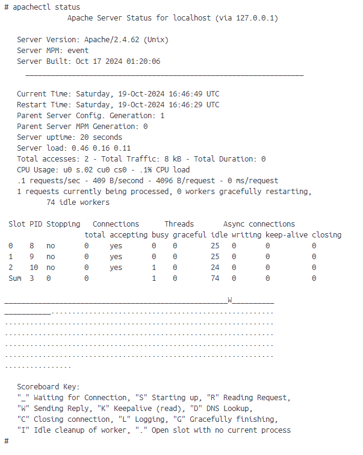
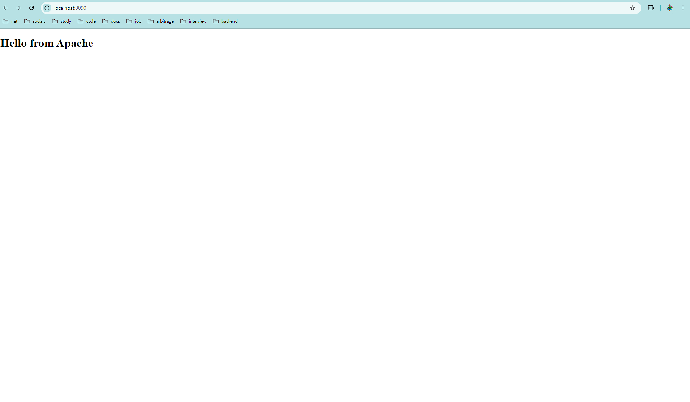
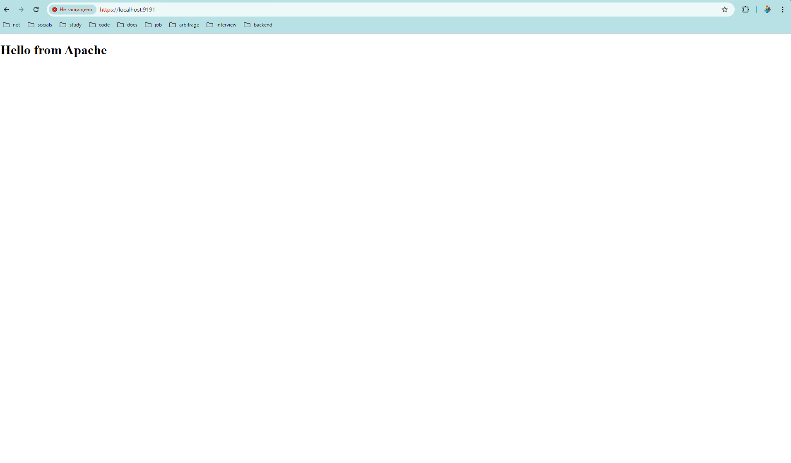
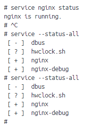
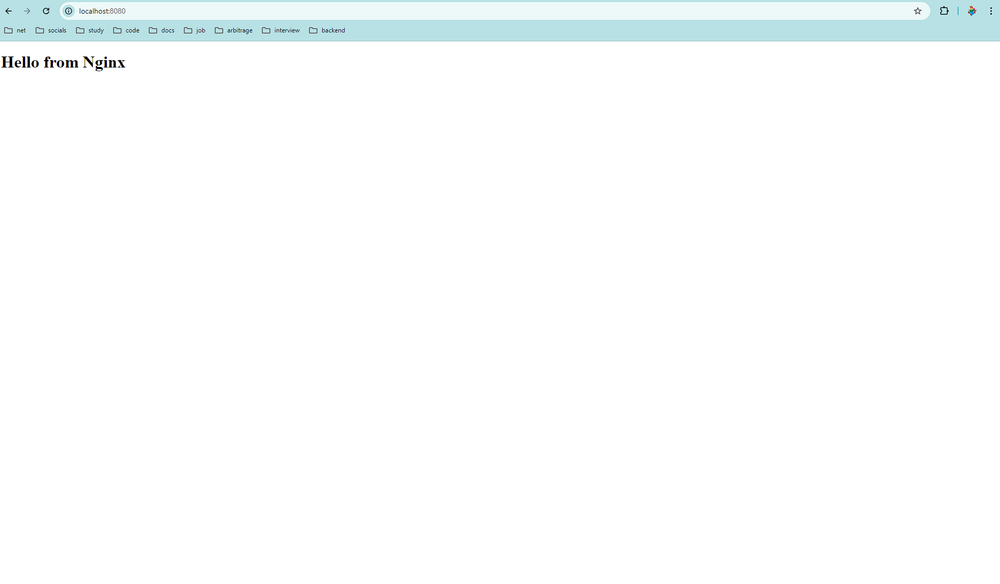
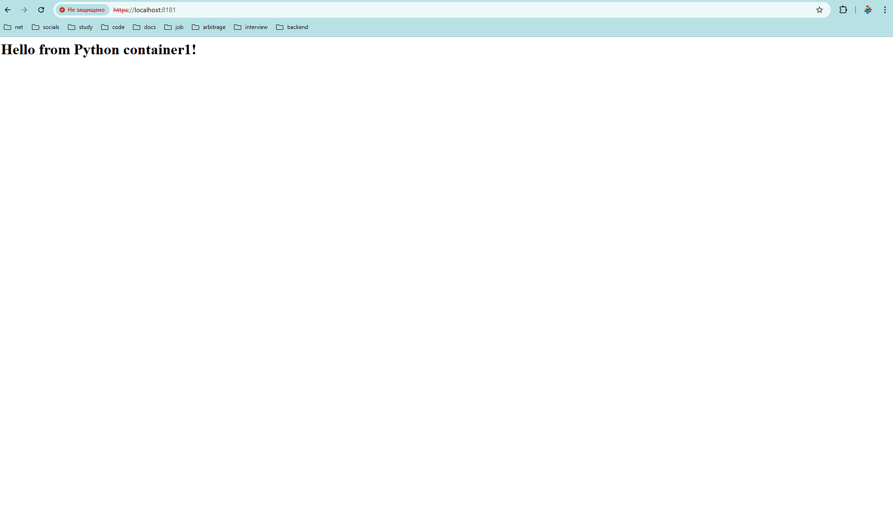
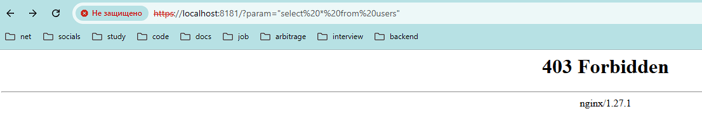
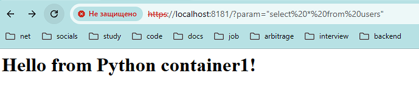

# Apache ([Dockerfile](./apache/Dockerfile))

- Проверка, что Apache работает

    

-  Скрин страницы по URL-адресу

    

- Генерация SSL-сертификата

    ```
    openssl req -new -newkey rsa:4096 -x509 -sha256 -days 365 -nodes -out server.crt -keyout server.key -config /task/src/sslconfig.cnf
    ```

- [Настройка Apache для использования SSL-сертификатов](./apache/src/writeHttpsConfig.sh)

- Проверка доступности через HTTPS

  

# Nginx ([Dockerfile](./nginx/Dockerfile))

- Проверка, что Nginx работает

    

- Скрин страницы по URL-адресу

    

- [Настройка прокси с балансировкой нагрузки](./nginx//src/nginx.conf)

  

  

- Генерация SSL-сертификата

  ```
  openssl req -new -newkey rsa:4096 -x509 -sha256 -days 365 -nodes -out nginx.crt -keyout nginx.key -config /task/src/sslconfig.cnf
  ```


- [Настройка https подключения](./nginx//src/nginx.conf)

  

- [Настройка ModSecurity в Nginx](./nginx//Dockerfile)

- [Настройка правил фильтрации ModSecutiry](./nginx//src/main.conf)

- Проверка защиты от SQL-инъекций

  

- Результат без правила фильтрации

  